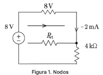
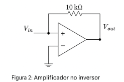

# Modelado de Circuitos Eléctricos - Aplicación de Nodos y Amplificador No Inversor
En esta clase abordamos el análisis de circuitos eléctricos mediante la aplicación de la Ley de Corrientes de Kirchhoff (LCK) y el uso de nodos. Además, se estudia el comportamiento de un amplificador operacional no inversor, herramienta fundamental en sistemas electrónicos. Aplicaremos ecuaciones diferenciales para describir estos sistemas y obtener sus modelos matemáticos.
## 1. Subtítulos
### 1.1 Aplicación de nodos en circuitos eléctricos
### 1.2 Modelado mediante la Ley de Corrientes de Kirchhoff
### 1.3 Amplificador no inversor
### 1.4 Modelo matemático de amplificadores


## 2. Definiciones
🔑 Nodo eléctrico:

Punto de un circuito donde convergen tres o más elementos eléctricos.

🔑 Ley de Corrientes de Kirchhoff (LCK):

En cualquier nodo, la suma algebraica de las corrientes que entran es igual a la suma de las que salen.

🔑 Amplificador operacional no inversor:

Circuito amplificador donde la señal de entrada se aplica a la entrada positiva del op-amp, generando una señal de salida en fase.

## 3. Subsecciones
### 3.1. Aplicación de nodos (LCK)
Se parte del análisis del circuito aplicando LCK:

$$iu​-i1-ic=0$$

$$i_{u}(t)-\frac{V_{AB}}{0.5}-2\frac{dy(t)}{dt}=0$$

$$V_{AB}=2\frac{dy(t)}{dt}+y(t)$$

Sustituyendo:

$$u(t)-\frac{2}{0.5}\frac{dy(t)}{dt}-\frac{1}{0.5}y(t)-2\frac{dy(t)}{dt}=0$$

$$u(t)-6\frac{dy(t)}{dt}-2y(t)=0$$

### 3.2. Amplificador no inversor

Condiciones del modelo ideal:

- $V^{+}=V^{-}$
- $i_{1}=i^{2}$
- $i_{entrada}=0$
- $Impedancia de entrada → infinita$
- Impedancia de salida → nula

Análisis de malla:

$$\frac{e_{o}-e_{i}}{R2}=\frac{e_{i}}{R1}$$

Despejando:

$$e_{o}=e_{i}(1+\frac{R2}{R1})$$

## 4. Ejemplos
### 💡 **Ejemplo 1:** Encontrar el valor de $R_1$ en el circuito.



**Análisis paso a paso:**

Aplicamos la **Ley de nodos de Kirchhoff**, que dice que la suma de corrientes en un nodo es cero:

$\[
\frac{8V}{R_1} + \frac{8V}{2k\Omega} + \frac{8V}{4k\Omega} = 0
\]$

$\[
\frac{8}{R_1} + 4\,\text{mA} + 2\,\text{mA} = 0
\]$

$\[
\frac{8}{R_1} = -6\,\text{mA}
\Rightarrow R_1 = \frac{8V}{6\,\text{mA}} = \frac{8}{0.006} = 1333.33\,\Omega \approx 1.33\,k\Omega
\]$

**Resultado:** $R_1 = 1.33\,k\Omega$

---

## 2. Amplificador no inversor

💡 **Ejemplo 2:** Calcular la ganancia de un amplificador no inversor.



**Análisis paso a paso:**

Sabemos que la fórmula para la ganancia de un amplificador no inversor es:

$\[
A_v = 1 + \frac{R_2}{R_1}
\]$

Con $R_1 = 1\,k\Omega$ y $R_2 = 10\,k\Omega$:

$\[
A_v = 1 + \frac{10k\Omega}{1k\Omega} = 1 + 10 = 11
\]$

**Resultado:** La ganancia es $A_v = 11$

---

## Código de simulación (Python)

Puedes usar `sympy` para simular y validar los cálculos:

```python
from sympy import symbols, Eq, solve

# Ejemplo 1: Nodo
R1 = symbols('R1')
eq1 = Eq(8/R1 + 8/2000 + 8/4000, 0)
R1_val = solve(eq1, R1)[0]
print(f"Valor de R1: {R1_val/1000:.2f} kΩ")

# Ejemplo 2: Ganancia no inversor
R1_val = 1e3  # 1kΩ
R2_val = 10e3  # 10kΩ
Av = 1 + R2_val/R1_val
print(f"Ganancia del amplificador no inversor: {Av}")
```


## 5. Tablas


💡**Ejemplo 1:** 

| **Parámetro** | **Símbolo** |*Unidad** |
|---------------|-----------------------------------------------|----------------------------------------------|
|       Resistencia       |                       $R$                      |                      Ohmios (Ω)                      |
|      Capacitancia      |                       $C$                       |                     Faradios (F)                    |
|    Tensión      |                      $V$                     |                      	Voltios (V)                    |
|    Corriente    |                       $I$                       |                     Amperios (A)                      |


Tabla 1. Parámetros eléctricos comunes

# 6. Conclusiones

-La ley de nodos es una herramienta clave para el análisis de circuitos eléctricos.

-Los amplificadores operacionales son versátiles y permiten construir múltiples configuraciones para manipular señales.

-El amplificador no inversor proporciona una salida en fase con la señal de entrada, siendo útil en múltiples aplicaciones analógicas.


## 7. Referencias

-Ogata, K. Ingeniería de Control Moderna. 5ta edición. Prentice Hall.

-C. Chen, Analog and Digital Control System Design. Saunders College Publishing.

-Wikipedia - Amplificador no inversor
