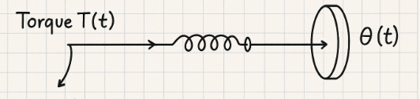
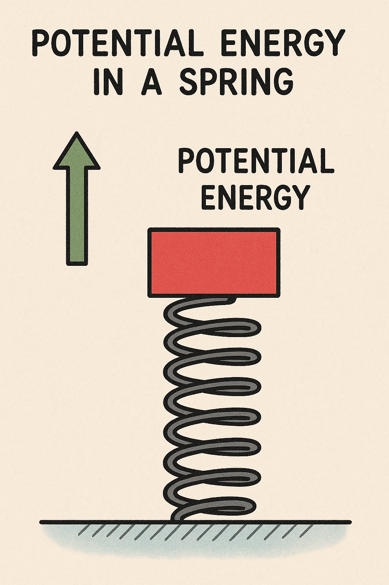

# ECUACION DIFERENCIAL, SISTEMAS ROTACIONALES, TRABAJO Y ENERGIA
Se resuelve  el analisis parra la ecuacion diferencial de la clase anterior y se ve el tema de sistemas rotacionales
## 1. ECUACION DIFERENCIAL, SIMULINK  Y OPE 45
Agregue todos los subtítulos que considere necesarios para estructurar el contenido de la clase. Es importante que considere jerarquías de los temas para definir el orden de estos subtítulos. Cada subtítulo debe ir numerado como una sección, de la manera en que lo presenta esta plantilla

## 2. SISTEMA ROTACIONAL

>🔑 *Sistema Rotacional:* Al igual que los sistemas mecánicos, que se rigen por principios físicos fundamentales, en este caso también nos encontramos ante un fenómeno físico. Sin embargo, la diferencia radica en la naturaleza del movimiento, ya que en lugar de tratarse de un desplazamiento lineal, ahora estamos frente a un movimiento de tipo angular. Es decir, en lugar de que un cuerpo se traslade en línea recta, experimenta una rotación alrededor de un eje, lo que implica la intervención de magnitudes como el momento de inercia, el torque y la velocidad angular.

### 2.1 LEYES
Las leyes que rigen estos tipos de sistemas son:
 FUERZA DE TORSION  

 $F_{R}=k*\varphi$ donde $\varphi$ es un angulo de torsion

FUERZA DE FRICCION

 $F_{F}=b\left(\frac{d\varphi}{dt}\right)$ donde $\frac{d\varphi }{dt}$ es la velocidad angular

 TORQUE

 $T=J(\frac{d^{2}\varphi}{dt^{2}})$ donde J es el movimiento de inercia
 
 ### 2.2 ANALISIS
 <p align="center">
   
  
</p>
  


Tomando el sentido de T como positivo,nos queda el planteamiento de la suma de fuerzas de tal manera:

$T-F_{R}-F_{F}=J\alpha $ donde $\alpha $ es la acelaracion angular

 Si la fuerza de torsion no es significativa:
 
 $T-F_{F}=J\alpha$

Y ahora utilizamos nuestras ecuaciones auxiliares para reemplazar y expresar todo en términos de una única variable.

$T(t)-k\theta(t)-b\left ( \frac{d\theta (t)}{dt} \right )= J\left ( \frac{d^{2}\theta (t)}{dt^{2}} \right )$
## 3. TRABAJO Y ENERGIAS
 ### 3.1 Trabajo
  >El trabajo es una medida de la realización de un esfuerzo mediante la aplicación de una fuerza que provoca un desplazamiento.

$$W=F_{x}[N*m]$$

Donde definimos en trabajo total realizado como $\int_{0}^{x}kxdx=\frac{1}{2}kx$

### 3.2 Energia y Potencia

 > *Energia* Es la capacidad de un sistema para realizar trabajo, manifestándose principalmente en dos formas: energía cinética, asociada al movimiento, y energía potencial, relacionada con la posición o configuración de un objeto dentro de un campo de fuerzas.
 >*Potencia*  Es la cantidad de trabajo realizado o energía transferida en un determinado período de tiempo. Indica qué tan rápido se realiza un trabajo o se transforma la energía en un sistema y se mide en vatios (W)
 #### 3.2.1 Energia Potencial:
  >La energía potencial es la energía que un objeto tiene debido a su posición o estado, como un resorte comprimido o un objeto elevado sobre el suelo.
 
 Se expresa de tal forma:

$$U= \int_{0}^{h}mgdx=mgh$$

 #### 3.2.2 Energia Cinetica:
  >La energía cinética es la energía que tiene un objeto debido a su movimiento. Cuanto más rápido se mueve el objeto y mayor sea su masa, más energía cinética posee. Esta energía se libera cuando el objeto se detiene o cambia su velocidad.

Y se expresa de tal forma para sistemas lineales:

$T= \frac{1}{2} mv^{2}$

Y para sistemas rotacionales:
 $T= \frac{1}{2}J\dot{\theta }^{2}$

Un cambio en la energía cinética de un objeto ocurre cuando una fuerza realiza trabajo sobre él, ya sea acelerándolo o desacelerándolo. Esta fuerza provoca una variación en la velocidad del objeto, lo que resulta en un aumento o disminución de su energía cinética. Este concepto está relacionado con el teorema del trabajo y la energía.

$\Delta T= \Delta W = \int_{x1}^{x2} F dx$ evaluamos en funcion al tiempo :

$\int_{t1}^{t2} F\frac{dx}{dt}dt$ como $\frac{dx}{dt}= v$ reemplazamos:

$\int_{t1}^{t2}Fvdt$

nose

$\int_{t1}^{t2}m\dot{v}vdt$
Dandonos como resultado en sistemas mecanicos:

$\int_{v1}^{v2}mvdv= \frac{1}{2}mv_{2}^{2}-\frac{1}{2}mv_{1}^{2}$

Dandonos como resultado en sistemas rotacionales:

$$\Delta T= \frac{1}{2}J\dot{\theta _{2}^{2}}-\frac{1}{2}J\dot{\theta _{1}^{2}}$$
#### 3.2.3 Potencia
Como dijimos anteriormente es la variacion del trabajo respecto al tiempo, quedandonos expresadosde tal forma:

$$P=\frac{dW}{dt}$$

Y expresamos la potencia media como: 
$$P_{media}=\frac{W_{realizado}(t_{2}-t_{1})}{(t_{2}-t_{1})}$$

## 4. Aplicando a sistemas mecanicos 
### 4.1 Resorte

<p align="center">
  
</p>


$ u= \int_{0}^{x}Fdx $ Aplicando ley de hooke ya que hablamos de resortes $u= \int_{0}^{x}Kxdx$ Evaluando la integral teniendo en cuenta K como constante $k[\frac{x^{2}}{2}]_{0}^{x} $ Nos queda que $ u= \frac{1}{2}kx^{2}$

Y aplicando lo mismo para EL CAMBIO DE ENERGIA nos da que :

$\Delta u= \int_{x_{1}}^{x_{2}}Fdx = \int_{x_1}^{x_2}Kxdx = K [\frac{x^{2}}{2}]_{x_1}^{x_2}$

$\Delta u= \frac{1}{2}kx_{1}^{2}-\frac{1}{2}kx_{2}^{1}$

*POTENCIA EN UN RESORTE*

Sabemos que la potencia es definida como la variacion del trabajo con respecto al tiempo

$P= \frac{dW}{dt}= \frac{Fdx}{dt}$ 

Sabiendo que $\frac{dx}{dt}=\dot{x}$ Tenemos que $P = F\dot{x}$ Y remplazando con ley de hooke y derivando $P= kx\dot{x}$ 

Retomando que $u= \frac{1}{2}kx^{2}$ Tenemos que:

$u= \frac{1}{2}kx^{2}$ Derivamos $u=\frac{1}{2}2kx\dot{x}= kx\dot{x}= P$
### 4.2 Masa
*POTENCIA EN UNA MASA*


 
## 3. Subsecciones
Las subsecciones pueden utilizarse para sub dividir ciertos temas que se tienen en clases, por ejemplo si se está trabajandolos conversores D/A, puede ser necesario subdividir este en circuito de resistencias ponderadas y circuito de escalera R2R. 
### 3.1. Título de subsecciones
Para la creación de estas subsecciones debe utilizar un tamaño de letra más pequeño, por lo tanto utilice la etiqueta '###' 
### 3.2. Numeración de subsecciones
Siga la numeración de la sección seguida de un punto y luego el número de la subsección.

## 4. Ejemplos
Si en algún caso pretende dar un ejemplo explicativo ya sea a través de texto o através de ecuaciones matemáticos, utilizar la palabra 'Ejemplo' seguido de una numeración consecutiva dentro de la clase. Utilice el emoji 💡 antecediendo la palabra.

## 5. Ecuaciones
Para la edición de ecuaciones debe utilizar la etiqueta '$$' al comienzo y final de la ecuación para que la ecuación quede centrada ocupando una línea. Si se quiere que la ecuación quede integrada en el texto debe utilizar la etiqueta '$' al comienzo y final de la ecuación. Las ecuaciones pueden ser editadas utilizando el código LATEX, en el siguiente enlace encuentran un editor de ecuaciones que les genera el código. http://www.alciro.org/tools/matematicas/editor-ecuaciones.jsp . Sin embargo hay muchas otras herramientas que pueden utilizar para esto.

💡**Ejemplo 1:** si se va a representar la ecuación de la ley de Ohm se puede mostrar así $R=\frac{V}{I}$ o también,

$$R=\frac{V}{I}$$

## 6. Figuras
Todas las figuras que incluya deben ser generadas por ustedes, **no utilizar las figuras de las presentaciones**. Para incluir figuras puede seguir los siguientes pasos:
* Primero escribimos .
* Después escribimos, dentro de los corchetes, el texto alternativo. Este es opcional y solo entra en acción cuando no se puede cargar la imagen correctamente.
* Después escribimos, dentro de los paréntesis, la ubicación del archivo (ya sea una url o una ubicación dentro de algun folder local). Se recomienda poner las imágenes en una carpeta que se llame imágenes dentro del repositorio github para que no tengan problemas al cargar las imágenes.

💡**Ejemplo 2:**


Figura 1. Figura de prueba

Incluya la respectiva etiqueta a modo de descripción de la figura y mantenga numeración consecutiva para todas las figuras de la clase.

## 7. Tablas
En caso de necesitar la inclusión de tablas para organizar información se recomienda el uso de la herramienta del siguiente enlace https://www.tablesgenerator.com/markdown_tables , la cual permite organizar la información dentro de la tabla y genera el código markdown automáticamente:

💡**Ejemplo 3:** 

| **Resultado** | **x = número de intentos hasta primer éxito** |
|---------------|-----------------------------------------------|
|       S       |                       1                       |
|       FS      |                       2                       |
|      FFS      |                       3                       |
|      ...      |                      ...                      |
|    FFFFFFS    |                       7                       |
|      ...      |                      ...                      |

Tabla 1. Tabla de ejemplo

Cada tabla debe llevar la etiqueta que describa su contenido y numeración consecutiva para todas las tablas

## 8. Código
Teniendo en cuenta que el curso requiere del desarrollo de código matlab, c, c++ u otro. Si requiere incluir pequeños segmentos de código en los apuntes hágalos de la siguiente manera:

💡**Ejemplo 4:**
```
var sumar2 = function(numero) {
  return numero + 2;
}
```

## 9. Ejercicios
Deben agregar 2 ejercicios con su respectiva solución, referentes a los temas tratados en cada una de las clases. Para agregar estos, utilice la etiqueta #, es decir como un nuevo título dentro de la clase con la palabra 'Ejercicios'. Cada uno de los ejercicios debe estar numerado y con su respectiva solución inmediatamente despues del enunciado. Antes del subtitulo de cada ejercicio incluya el emoji 📚

## Rúbrica
| 0-1                                                                                   | 1-2                                                                                  | 2-3                                                                                                                                                                               | 3-4                                                                                                                                                                       | 4-5                                                                                                                                                                               |
|---------------------------------------------------------------------------------------|--------------------------------------------------------------------------------------|-----------------------------------------------------------------------------------------------------------------------------------------------------------------------------------|---------------------------------------------------------------------------------------------------------------------------------------------------------------------------|-----------------------------------------------------------------------------------------------------------------------------------------------------------------------------------|
| Presenta menos del 10% de los temas o no presenta por  el medio y formato  solicitado | Presenta menos del 40% de los temas solicitados, y  cumple parcialmente la plantilla | Presenta menos del 60% de los temas solicitados (con descripciones, gráficos tablas, etc), y cumple  parcialmente la plantilla. No presenta la totalidad  de ejercicios resueltos | Presenta menos del 80% de los temas solicitados (con descripciones, gráficos, tablas, etc) y cumple con  la plantilla. No presenta  la totalidad de ejercicios  resueltos | Presenta el 100% de los temas vistos en clase (con descripciones, gráficos, tablas, etc), siguiendo totalmente la plantilla. presenta la  totalidad de los ejercicios solicitados |

## 10. Conclusiones
Agregue unas breves conclusiones sobre los temas trabajados en cada clase, puede ser a modo de resumen de lo trabajado o a indicando lo aprendido en cada clase

## 11. Referencias
Agregue un subtítulo al final donde pueda poner todas las referencias consultadas incluyendo el origen o fuente de los ejercicios planteados. Tambien dentro del texto referencie los textos o artículos consultados y las figuras y tablas dentro de la explicación de las mismas.
