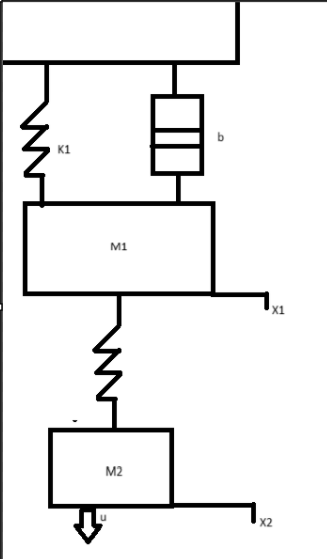
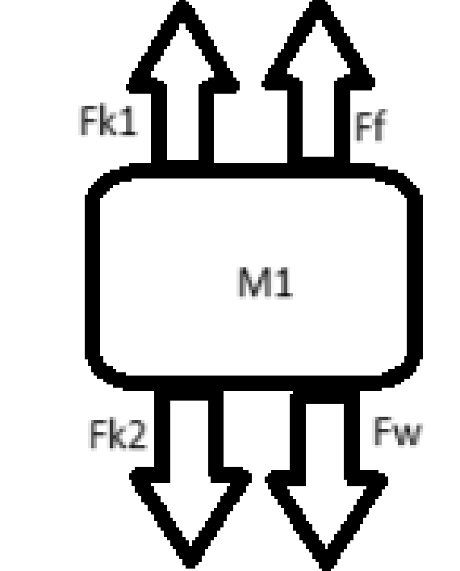
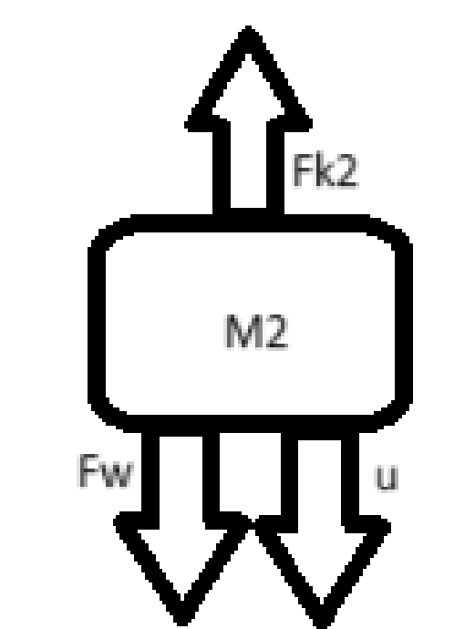
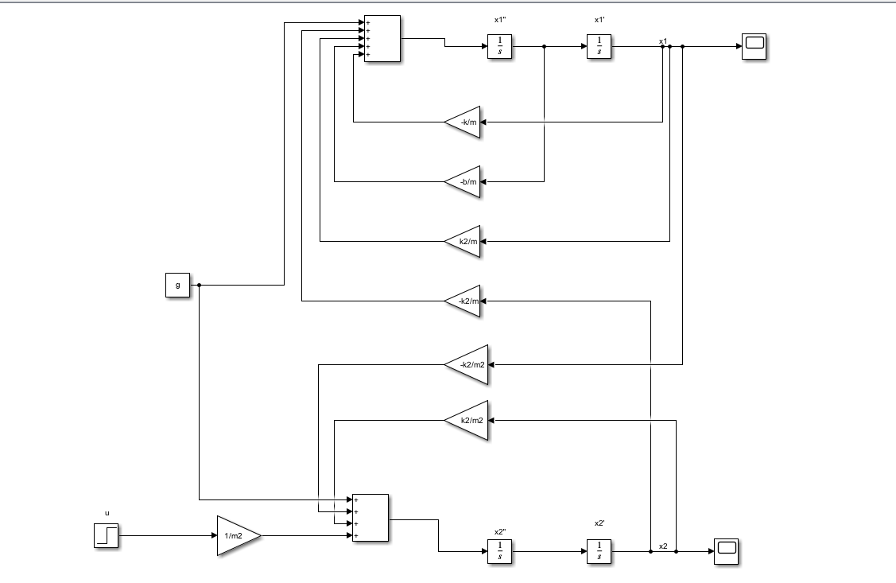
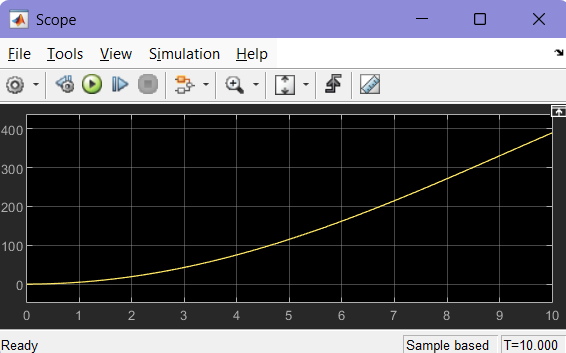
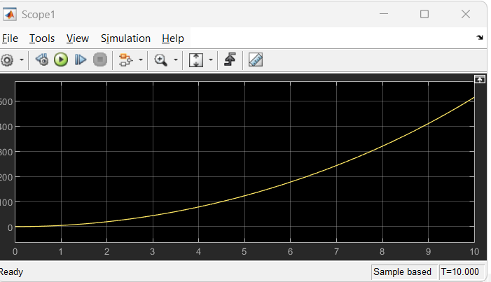
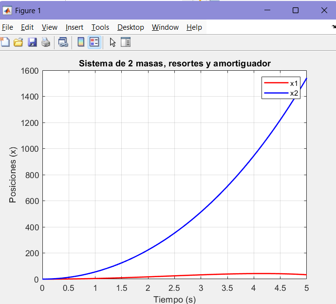
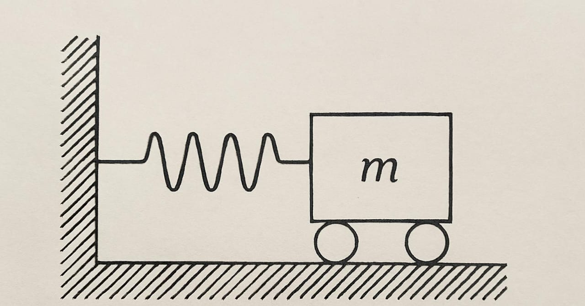

# ECUACION DIFERENCIAL, SISTEMAS ROTACIONALES, TRABAJO Y ENERGIA
Se resuelve  el analisis parra la ecuacion diferencial de la clase anterior y se ve el tema de sistemas rotacionales
## 1. ECUACION DIFERENCIAL, SIMULINK  Y OPE 45
Tenemos el siguiente sistema mecanico

 <p align="center">
   
</p>

Y hacemos los diagramas de fuerzas


<div align="center" style="display: flex; justify-content: center; gap: 20px;">

  

  
</div>

DE DIAGRAMA 1

$fk_1 + ff - fk_2 - fw = -m_1 \cdot a_{m1}$

DE DIAGRAMA 2

$fr_2 - fw - u = -m_2 \cdot a_{m2}$

1)

$k_1 \cdot x_1(t) + b \cdot \left[ \frac{d[x_1(t) - x_2(t)]}{dt} \right] - m_1 \cdot g - k_2 \cdot [x_1(t) - x_2(t)] = -m_1 \cdot \frac{d^2 x_1(t)}{dt^2}$

2)

$k_2 \cdot [x_1(t) - x_2(t)] - m_2 \cdot g - u = -m_2 \cdot \frac{d^2 x_2(t)}{dt^2}$


$k_1 \cdot x_1 + b \cdot x_1' - k_2 \cdot [x_1 - x_2] - m_1 \cdot g = -m_1 \cdot x_1''$
1)


$k_2 \cdot [x_1 - x_2] - m_2 \cdot g - u = -m_2 \cdot x_2''$
---

Laplace:

$0.3x_1 + x_2[5s^2 - 0.3] = \dfrac{550}{s}$

$x_1[10s^2 + 0.1s - 0.1] + 0.3x_2 = \dfrac{98}{s}$


Paso 1: Despejamos $x_1$ de la primera ecuación:

De: $0.3x_1 + x_2[5s^2 - 0.3] = \dfrac{550}{s}$

Despejamos $x_1$:

$x_1 = \dfrac{1}{0.3} \left[\dfrac{550}{s} - x_2[5s^2 - 0.3] \right]$

$x_1 = \dfrac{550}{0.3s} - \dfrac{1}{0.3} x_2[5s^2 - 0.3]$


Paso 2: Sustituimos esta expresión en la segunda ecuación:

$x_1[10s^2 + 0.1s - 0.1] + 0.3x_2 = \dfrac{98}{s}$

Sustituimos $x_1$:

$\left[\dfrac{550}{0.3s} - \dfrac{1}{0.3} x_2[5s^2 - 0.3] \right][10s^2 + 0.1s - 0.1] + 0.3x_2 = \dfrac{98}{s}$

Distribuimos cada término:

$\dfrac{550}{0.3s}[10s^2 + 0.1s - 0.1] - \dfrac{1}{0.3}x_2[5s^2 - 0.3][10s^2 + 0.1s - 0.1] + 0.3x_2 = \dfrac{98}{s}$


Paso 3: Simplificamos términos numéricos:

$\dfrac{550}{0.3s} = \dfrac{5500}{3s}$

Entonces:

$\dfrac{5500}{3s}[10s^2 + 0.1s - 0.1] - \dfrac{1}{0.3}x_2[5s^2 - 0.3][10s^2 + 0.1s - 0.1] + 0.3x_2 = \dfrac{98}{s}$

Multiplicamos los polinomios para simplificar la parte de $x_2$:

$[5s^2 - 0.3][10s^2 + 0.1s - 0.1] = 50s^4 + 0.5s^3 - 0.5s^2 - 3s^2 - 0.03s + 0.03$

$= 50s^4 + 0.5s^3 - 3.5s^2 - 0.03s + 0.03$

Y ahora toda la parte de $x_2$ queda:

$- \dfrac{1}{0.3}x_2[50s^4 + 0.5s^3 - 3.5s^2 - 0.03s + 0.03] + 0.3x_2$


Paso 4: Reunimos todos los términos:

$\dfrac{5500}{3s}[10s^2 + 0.1s - 0.1] - \dfrac{1}{0.3}x_2[50s^4 + 0.5s^3 - 3.5s^2 - 0.03s + 0.03] + 0.3x_2 = \dfrac{98}{s}$

Calculamos el primer producto escalar:

$\dfrac{5500}{3s}(10s^2 + 0.1s - 0.1) = \dfrac{5500}{3s}[10s^2 + 0.1s - 0.1] = \dfrac{5500}{3}[10s + 0.1 - \dfrac{0.1}{s}]$


Paso 5: Reorganizamos todo como una ecuación racional para despejar $x_2$:

$\left(- \dfrac{1}{0.3}[50s^4 + 0.5s^3 - 3.5s^2 - 0.03s + 0.03] + 0.3 \right) x_2 = \dfrac{98}{s} - \dfrac{5500}{3s}(10s^2 + 0.1s - 0.1)$

Y luego simplificamos para obtener:

$x_2(s) = \dfrac{\text{Numerador}}{\text{Denominador}}$

Donde el denominador es:

$- \dfrac{1}{0.3}[50s^4 + 0.5s^3 - 3.5s^2 - 0.03s + 0.03] + 0.3$


Paso 6: Una vez que tenemos $x_2(s)$, sustituimos en la fórmula de $x_1(s)$:

$x_1 = \dfrac{550}{0.3s} - \dfrac{1}{0.3} x_2[5s^2 - 0.3]$


Paso 7: Fracciones parciales y transformada inversa

$\dfrac{A}{s} + \dfrac{Bs + C}{s^2 + as + b}$

$\mathcal{L}^{-1} \left[ \dfrac{A}{s} \right] = A$

$\mathcal{L}^{-1} \left[ \dfrac{Bs + C}{s^2 + as + b} \right] = e^{-\alpha t}(B \cos(\omega t) + C \sin(\omega t))$ con $\omega = \sqrt{b - a^2/4}$


Paso 8: Sustituimos $x_1$ en términos de $x_2$

$x_1 = \dfrac{550}{0.3s} - \dfrac{1}{0.3}x_2[5s^2 - 0.3]$

Ahora sustituimos $x_2(s)$ 

$x_2(s) = \dfrac{N(s)}{D(s)}$

Donde:

$N(s) = 98 - \dfrac{5500}{3}(10s^2 + 0.1s - 0.1)$

$D(s) = -\dfrac{1}{0.3}(50s^4 + 0.5s^3 - 3.5s^2 - 0.03s + 0.03) + 0.3$

Ahora multiplicamos:

$x_1(s) = \dfrac{550}{0.3s} - \dfrac{1}{0.3}[5s^2 - 0.3]\cdot\dfrac{N(s)}{D(s)}$

Unificamos:

$x_1(s) = \dfrac{550}{0.3s} - \dfrac{[5s^2 - 0.3]N(s)}{0.3D(s)}$


Paso 9: Fracciones parciales para $x_1(s)$ y $x_2(s)$


$x_1(s) = \dfrac{A}{s} + \dfrac{Bs + C}{s^2 + 2s + 10}$
$x_2(s) = \dfrac{D}{s} + \dfrac{Es + F}{s^2 + 2s + 10}$


Paso 10: Aplicamos transformada inversa de Laplace

Sabemos que:

$\mathcal{L}^{-1} \left[ \dfrac{1}{s} \right] = 1$

$\mathcal{L}^{-1} \left[ \dfrac{s + a}{(s + a)^2 + b^2} \right] = e^{-at}\cos(bt)$

$\mathcal{L}^{-1} \left[ \dfrac{b}{(s + a)^2 + b^2} \right] = e^{-at}\sin(bt)$


Entonces:

$\mathcal{L}^{-1}[x_1(s)] = A + Be^{-at}\cos(bt) + Ce^{-at}\sin(bt)$
$\mathcal{L}^{-1}[x_2(s)] = D + Ee^{-at}\cos(bt) + Fe^{-at}\sin(bt)$


---

Paso 11: Resultado final


$x_1(s) = \dfrac{150}{s} - \dfrac{200s + 600}{(s + 1)^2 + 9}$
$x_2(s) = \dfrac{50}{s} + \dfrac{100s + 400}{(s + 1)^2 + 9}$

Aplicamos:

Solución en el tiempo para $x_1(t)$:

$x_1(t) = 150 - 200e^{-t}\cos(3t) - \dfrac{600}{3}e^{-t}\sin(3t)$
$x_1(t) = 150 - 200e^{-t}\cos(3t) - 200e^{-t}\sin(3t)$

Solución en el tiempo para $x_2(t)$:

$x_2(t) = 50 + 100e^{-t}\cos(3t) + \dfrac{400}{3}e^{-t}\sin(3t)$
$x_2(t) = 50 + 100e^{-t}\cos(3t) + 133.33e^{-t}\sin(3t)$

*SIMULINK*

 <p align="center">
   
</p>


<div align="center" style="display: flex; justify-content: center; gap: 20px;">

  

  
</div>

*OD45*

```
clc; clear;

% Parámetros
k1 = 0.2; 
k2 = 0.3; 
b  = 0.1; 
m1 = 10; 
m2 = 5; 
g  = 9.81; 
u  = 500; 

% Tiempo integración
tspan = (0:0.01:5);

% Condiciones Iniciales: [x1(0), v1(0), x2(0), v2(0)]
y0 = [0; 0; 0; 0]; 

% Solver
[t, y] = ode45(@miODE, tspan, y0);

% Graficar
plot(t, y(:,1), 'r', 'LineWidth', 1.5); hold on; % x1
plot(t, y(:,3), 'b', 'LineWidth', 1.5);          % x2
legend('x1', 'x2');
xlabel('Tiempo (s)');
ylabel('Posiciones (x)');
title('Sistema de 2 masas, resortes y amortiguador');
grid on;

% EDO
function dy = miODE(t, y)
    % Parámetros dentro de la función
    k1 = 0.2; 
    k2 = 0.3; 
    b  = 0.1; 
    m1 = 10; 
    m2 = 5; 
    g  = 9.81; 
    u  = 500; 

    % Variables
    x1 = y(1);
    v1 = y(2);
    x2 = y(3);
    v2 = y(4);

    % Ecuaciones
    dx1 = v1;
    dv1 = ((-k1 + k2)*x1 - b*v1 - k2*x2 + m1*g) / m1;
    dx2 = v2;
    dv2 = (-k2*x1 + k2*x2 + m2*g + u) / m2;

    dy = [dx1; dv1; dx2; dv2];
end
}
```
<p align="center">
   
</p>


## 2. SISTEMA ROTACIONAL

>🔑 *Sistema Rotacional:* Al igual que los sistemas mecánicos, que se rigen por principios físicos fundamentales, en este caso también nos encontramos ante un fenómeno físico. Sin embargo, la diferencia radica en la naturaleza del movimiento, ya que en lugar de tratarse de un desplazamiento lineal, ahora estamos frente a un movimiento de tipo angular. Es decir, en lugar de que un cuerpo se traslade en línea recta, experimenta una rotación alrededor de un eje, lo que implica la intervención de magnitudes como el momento de inercia, el torque y la velocidad angular.

### 2.1 LEYES
Las leyes que rigen estos tipos de sistemas son:
 FUERZA DE TORSION  

 $F_{R}=k*\varphi$ donde $\varphi$ es un angulo de torsion

FUERZA DE FRICCION

 $F_{F}=b\left(\frac{d\varphi}{dt}\right)$ donde $\frac{d\varphi }{dt}$ es la velocidad angular

 TORQUE
 >Es una medida de la fuerza que hace girar un objeto alrededor de un eje o punto. Se calcula multiplicando la fuerza aplicada por la distancia al eje de giro.

 $T=J(\frac{d^{2}\varphi}{dt^{2}})$ donde J es el movimiento de inercia
 
 ### 2.2 ANALISIS
 <p align="center">
   
</p>


Tomando el sentido de T como positivo,nos queda el planteamiento de la suma de fuerzas de tal manera:

$T-F_{R}-F_{F}=J\alpha $ donde $\alpha $ es la acelaracion angular

 Si la fuerza de torsion no es significativa:
 
 $T-F_{F}=J\alpha$

Y ahora utilizamos nuestras ecuaciones auxiliares para reemplazar y expresar todo en términos de una única variable.

$T(t)-k\theta(t)-b\left ( \frac{d\theta (t)}{dt} \right )= J\left ( \frac{d^{2}\theta (t)}{dt^{2}} \right )$
## 3. TRABAJO Y ENERGIAS
 ### 3.1 Trabajo
  >El trabajo es una medida de la realización de un esfuerzo mediante la aplicación de una fuerza que provoca un desplazamiento.

$$W=F_{x}[N*m]$$

Donde definimos en trabajo total realizado como $\int_{0}^{x}kxdx=\frac{1}{2}kx$

### 3.2 Energia y Potencia

 > *Energia* Es la capacidad de un sistema para realizar trabajo, manifestándose principalmente en dos formas: energía cinética, asociada al movimiento, y energía potencial, relacionada con la posición o configuración de un objeto dentro de un campo de fuerzas.
 >*Potencia*  Es la cantidad de trabajo realizado o energía transferida en un determinado período de tiempo. Indica qué tan rápido se realiza un trabajo o se transforma la energía en un sistema y se mide en vatios (W)
 #### 3.2.1 Energia Potencial:
  >La energía potencial es la energía que un objeto tiene debido a su posición o estado, como un resorte comprimido o un objeto elevado sobre el suelo.
 
 Se expresa de tal forma:

$$U= \int_{0}^{h}mgdx=mgh$$

 #### 3.2.2 Energia Cinetica:
  >La energía cinética es la energía que tiene un objeto debido a su movimiento. Cuanto más rápido se mueve el objeto y mayor sea su masa, más energía cinética posee. Esta energía se libera cuando el objeto se detiene o cambia su velocidad.

Y se expresa de tal forma para sistemas lineales:

$T= \frac{1}{2} mv^{2}$

Y para sistemas rotacionales:
 $T= \frac{1}{2}J\dot{\theta }^{2}$

Un cambio en la energía cinética de un objeto ocurre cuando una fuerza realiza trabajo sobre él, ya sea acelerándolo o desacelerándolo. Esta fuerza provoca una variación en la velocidad del objeto, lo que resulta en un aumento o disminución de su energía cinética. Este concepto está relacionado con el teorema del trabajo y la energía.

$\Delta T= \Delta W = \int_{x1}^{x2} F dx$ evaluamos en funcion al tiempo :

$\int_{t1}^{t2} F\frac{dx}{dt}dt$ como $\frac{dx}{dt}= v$ reemplazamos:

$\int_{t1}^{t2}Fvdt$

nose

$\int_{t1}^{t2}m\dot{v}vdt$
Dandonos como resultado en sistemas mecanicos:

$\int_{v1}^{v2}mvdv= \frac{1}{2}mv_{2}^{2}-\frac{1}{2}mv_{1}^{2}$

Dandonos como resultado en sistemas rotacionales:

$$\Delta T= \frac{1}{2}J\dot{\theta _{2}^{2}}-\frac{1}{2}J\dot{\theta _{1}^{2}}$$
#### 3.2.3 Potencia
Como dijimos anteriormente es la variacion del trabajo respecto al tiempo, quedandonos expresadosde tal forma:

$$P=\frac{dW}{dt}$$

Y expresamos la potencia media como: 
$$P_{media}=\frac{W_{realizado}(t_{2}-t_{1})}{(t_{2}-t_{1})}$$

## 4. Aplicando a sistemas mecanicos 
### 4.1 Resorte

<p align="center">
  
</p>

Tenemos  que

$$u= \int_{0}^{x}Fdx$$

Aplicando ley de hooke ya que hablamos de resortes $u= \int_{0}^{x}Kxdx$ 

Evaluando la integral teniendo en cuenta K como constante $k[\frac{x^{2}}{2}]_{0}^{x}$

Nos queda que $u= \frac{1}{2}kx^{2}$

Y aplicando lo mismo para EL CAMBIO DE ENERGIA nos da que :

$\Delta u= \int_{x_{1}}^{x_{2}}Fdx = \int_{x_1}^{x_2}Kxdx = K [\frac{x^{2}}{2}]_{x_1}^{x_2}$

$\Delta u= \frac{1}{2}kx_{1}^{2}-\frac{1}{2}kx_{2}^{1}$

*POTENCIA EN UN RESORTE*

Sabemos que la potencia es definida como la variacion del trabajo con respecto al tiempo

$P= \frac{dW}{dt}= \frac{Fdx}{dt}$ 

Sabiendo que $\frac{dx}{dt}=\dot{x}$ Tenemos que $P = F\dot{x}$ Y remplazando con ley de hooke y derivando $P= kx\dot{x}$ 

Retomando que $u= \frac{1}{2}kx^{2}$ Tenemos que:

$u= \frac{1}{2}kx^{2}$ Derivamos $u=\frac{1}{2}2kx\dot{x}= kx\dot{x}= P$
### 4.2 Masa
*POTENCIA EN UNA MASA*

La cantidad de potencia necesaria para acelerar una masa en movimiento rectilíneo es equivalente a:

$$ P=m\ddot{x}\dot{x}$$

Considerando que $T= \frac{1}{2}mv^{2}$ representa la energía cinética de la masa, obtenemos que:

$$P=m\ddot{x}\dot{x}-m\dot{v}v=\dot{T}$$
### 4.3 Amortiguador
*ENERGIA DISIPADA*

La energía que se pierde en un amortiguador equivale al trabajo neto efectuado sobre él:

$\Delta w= \int_{x1}^{x2}Fdx= \int_{x1}^{x2}b\dot{x}dx$

Respecto al tiempo tenemos que(por $\frac{dt}{dt}$)

$b\int_{t1}^{t2}\dot{x}\frac{dx}{dt}dt= b\int_{t1}^{t2}\dot{x^{2}}dt$

*no importa el signo de la velocidad* ($\dot{x}$)
 *POTENCIA DISIPADA*

 La potencia que se disipa debido a las fuerzas de amortiguamiento en el cilindro corresponde a:

 $$P= \frac{dw}{dt}= F\frac{dx}{dt}= F\dot{x}$$

 Teniendo en cuenta que $F=b\dot{x}$ decimos que $P=b\dot{x}$

## 5. SISTEMAS CONSERVATIVOS
>Un sistema conservativo es aquel en el que la energía total (como la suma de energía cinética y potencial) se mantiene constante a lo largo del tiempo, ya que no hay pérdida de energía por efectos como la fricción o el rozamiento.

Sabemos que toda la energía (cinética y potencial) sale del sistema en forma de trabajo mecánico:

$\Delta (T+u)=\Delta w$

Si no entra energía externa al sistema, entonces la suma de la energía cinética (T) y la energía potencial (U) se mantiene constante.

 $\Delta (T+u)= 0$

 ## 5.📚 EJERCICIOS

 📚1.
 <p align="center">
   
</p>

Ya que trabajamos con sistemas conservativos, decimos que si no hay fricción, la disipación de energía se desprecia.

Siendo el planteamiento de ecuaciones de tal forma:

$$T+u= \frac{1}{2}m\dot{x^{2}}+\frac{1}{2}kx^{2}= CONSTANTE$$

AL momento de derivar nos da que:
 $$\frac{d}{dt}(T+u)= m\dot{x}\ddot{x}+k\dot{x}x$$

Como es conservativo $\Delta (T+u)= 0$

$0= m\dot{x}\ddot{x}+k\dot{x}x$

Y factorizamos $\dot{x}$

$(m\ddot{x}+kx)\dot{x}=0$

Para mantener el sistema conservativo alguno de los terminos ya sea ($(m\ddot{x}+kx)$) o ($\dot{x}$) tienen que ser 0, asi que por facilidad decimos que :

$$m\ddot{x}+kx=0$$


📚2.
 <p align="center">
   
</p>


Se debe tomar en cuenta la posicion incial: 

   $u_0 = m \cdot g \cdot x_0 + \frac{1}{2} \cdot k \cdot \delta^2$
   
Si esta en equilibrio entonces: 

  $k \cdot \delta = m \cdot g$

$u = m \cdot g \cdot (x_0 - x) + \frac{1}{2} \cdot k \cdot (\delta + x)^2$

$u = m \cdot g \cdot x_0 - m \cdot g \cdot x + \frac{1}{2} \cdot k \cdot \delta^2 + k \cdot \delta \cdot x + \frac{1}{2} \cdot k \cdot x^2$

$u = m \cdot g \cdot x_0 + \frac{1}{2} \cdot k \cdot \delta^2 - [m \cdot g + k \cdot \delta] \cdot x + \frac{1}{2} \cdot k \cdot x^2$

$E_{\text{inicial}} = m \cdot g \cdot x_0 + \frac{1}{2} \cdot k \cdot \delta^2$

$E_{\text{potencial}} = -[m \cdot g + k \cdot \delta] \cdot x + \frac{1}{2} \cdot k \cdot x^2$

Energia cinetica es: 

$T = \frac{1}{2} \cdot m \cdot (\dot{x})^2$

$T + U = \frac{1}{2} \cdot m \cdot (\dot{x})^2 + U_0 + \frac{1}{2} \cdot k \cdot x^2 = \text{constante}$

Al derivar se obtiene la ecuación de movimiento:

$\frac{d}{dt}(T + U) = m \cdot \dot{x} \cdot \ddot{x} + k \cdot x \cdot \dot{x} = 0$

$\dot{x} \cdot [m \cdot \ddot{x} + k \cdot x] = 0$

Por lo tanto:

$m \cdot \ddot{x} + k \cdot x = 0$

## 6. Conclusiones
A lo largo de esta clase, se abordó de manera integral la resolución de sistemas de ecuaciones diferenciales de segundo orden, comenzando con su formulación y transformación a sistemas de primer orden para su posterior análisis tanto analítico como numérico. Se utilizaron herramientas como la simulación por bloques en Simulink y el método ODE45 en MATLAB, permitiendo visualizar el comportamiento dinámico de los sistemas mediante sus gráficas de evolución temporal.

Posteriormente, se profundizó en el estudio de sistemas rotacionales, aplicando leyes fundamentales de la física como las leyes de Newton, y conceptos de trabajo y energía. Se analizaron detalladamente las expresiones de energía cinética y potencial, así como la potencia y potencia media en sistemas mecánicos reales.

Se estudiaron también aplicaciones específicas como la energía potencial en un resorte, el cambio de energía en función de la deformación, y el concepto de energía disipada en un sistema amortiguado. Finalmente, se exploraron las condiciones de sistemas conservativos, destacando la importancia de la conservación de la energía mecánica total como criterio de análisis.

Este recorrido permitió no solo entender el comportamiento físico de estos sistemas, sino también aplicar herramientas de simulación y formulación matemática, fundamentales para el diseño y análisis de sistemas mecánicos complejos.


