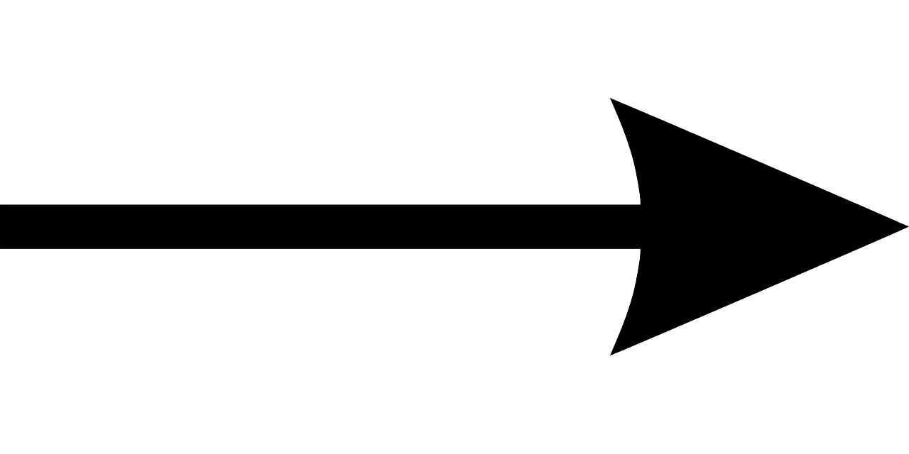

# ECUACIONES DIFERENCIALES DE PRIMER ORDEN

## 1. DESCRIPCIONES

La forma general de una ecuación diferencial de primer orden consiste en una combinación lineal de la derivada de la variable dependiente y la propia variable, igualada a una función de entrada.

$ay' + by = cu(t)$
Para obtener la función de transferencia del sistema, aplicamos la transformada de Laplace a la ecuación diferencial, considerando condiciones iniciales nulas:

Aplicando la transformada de Laplace:

$aY(s)s + bY(s) = cU(s)$

Despejando salida sobre entrada tenemos que: 

$\frac{y(s)}{u(s)} = \frac{c}{as + b}$

Las funciones de transferencia de primer orden se originan a partir de ecuaciones diferenciales de primer orden. Estas ecuaciones describen cómo evoluciona un sistema en función del tiempo y una entrada dada.

Al aplicar la transformada de Laplace, se puede observar que los parámetros constantes presentes en la ecuación diferencial también se mantienen en la función de transferencia resultante. Es decir, no se pierden en el proceso de transformación.

Los coeficientes $a$, $b$ y $c$ que aparecen en la ecuación diferencial representan parámetros físicos del sistema, como resistencias, inductancias, capacidades, masas o fricciones, dependiendo del tipo de sistema modelado. Estos parámetros son los que determinan el comportamiento dinámico del sistema.

### 1.1 💡 Ejemplo 1: 

 
  

$a\dot{y}(t) + b y(t) = c u(t)$  

$\frac{y(s)}{u(s)} = \frac{c}{as + b}$  

$r_1 a_1 \dot{h}_1 = r_1 q_i - h_1$

Estas constantes serían las equivalentes a las constantes de la ecuación diferencial que habíamos mostrado antes, de $\frac{c}{as + b}$.  

$a = r_1 a_1$  

$b = 1$  

$c = r_1$

Estas constantes serían las equivalentes a la ecuación diferencial que habíamos mostrado antes, de $as + b$.  

por lo cual, nos quedaría  

$\frac{h_1(s)}{q_i(s)} = \frac{r_1}{r_1 a_1 s + 1}$

## 2. FORMAS CANÓNICA

La forma general de la ecuación diferencial no permite identificar directamente los parámetros temporales del sistema. Por ello, en control se prefiere usar la forma canónica.

$$\frac{y(s)}{u(s)} = \frac{c}{as + b}$$

Para obtenerla, se divide por $b$ todos los términos de la función de transferencia, de modo que esta quede expresada como:

$\frac{y(s)}{u(s)} = \frac{\frac{c}{b}}{\frac{a}{b} s + 1}$

La forma canónica considera ciertas constantes importantes para caracterizar el sistema.

Primero, $\tau$ se define como $\frac{a}{b}$ y representa la constante de tiempo, que indica cuánto tarda el sistema en responder ante una entrada.

Luego, $k$ es igual a $\frac{c}{b}$ y se denomina ganancia estática, que indica el valor final o estado estacionario que alcanza la salida.

Por lo tanto, tomando en cuenta estas definiciones, la función de transferencia puede expresarse como la relación entre la salida y la entrada en el dominio de Laplace, dada por:

$$\frac{y(s)}{u(s)} = \frac{k}{\tau s + 1}$$

Siendo esta la forma canónica de sistemas de primer orden.

Ahora, nos devolvemos al ejercicio anterior donde  

$\frac{h_1(s)}{q_i(s)} = \frac{r_1}{r_1 a_1 s + 1}$  

Podemos identificar que  $k = r_1$     $\tau = r_1 a_1$

### 2.1 💡Ejemplo 2: 
 $\frac{y(s)}{u(s)} = \frac{0.8}{s + 4}$  

Vamos a dividir todo por $b$ que sería 4, entonces nos queda  

$\frac{y(s)}{u(s)} = \frac{0.8}{4} \bigg/ \left(\frac{s}{4} + \frac{4}{4}\right)$  

$\frac{y(s)}{u(s)} = \frac{0.2}{\frac{1}{4} s + 1}$

Por lo cual $\tau$ sería $0.25$ y $k$ sería $0.2$

## 3. RESPUESTA TEMPORAL DE UN SISTEMA DE PRIMER ORDEN ANTE UNA ENTRADA ESCALON

$y(s) = u(s) \cdot \frac{k}{\tau s + 1}$

$y(s) = \frac{a}{s} \cdot \frac{k}{\tau s + 1}$

$y(s) = \frac{ak}{s(\tau s + 1)}$

      
LasELEMENTOS
*FLECHA*

Es la relación entre las variables del sistema

  

*NODO*

  
  Es la representación de señales
  
  

## 3. INTERPRETACION
Dado que el nodo representa una señal y la flecha indica la relación entre variables, cuando una flecha parte de un nodo —es decir, cuando hay una conexión de entrada a salida—, se interpreta que la señal de salida es igual a la señal de entrada multiplicada por la ganancia o relación entre esas variables.

 
  

$$Y(s)=F(s)X(s)$$

Cuando varias señales convergen en un mismo nodo, se interpreta que en ese punto se realiza la suma de todas ellas, cada una multiplicada por su respectiva ganancia.

 
  

$$Y(s)=F_{1}(s)X_{1}(s)+F_{2}(s)X_{2}(s)-F_{3}(s)X_{3}(s)$$

## 3. DEFINICIONES

>🔑*Camino o trayectoria* : Un camino o trayectoria es un recorrido por una secuencia de ramas (aristas) conectadas siguiendo el sentido de las flechas en un grafo dirigido.

>🔑* Camino abierto* : Si en dicho recorrido no se visita ningún nodo más de una vez (es decir, no se repiten nodos), se dice que el camino o trayectoria es abierto.

>🔑*Ciclo simple* : Si el camino o trayectoria comienza y termina en el mismo nodo, y no se repite ningún otro nodo en el recorrido, se dice que es un camino o trayectoria cerrado (también conocido como ciclo simple o circuito simple).
Ganancia de lazo: Es el producto de las ganancias de las ramas que forman un lazo (ciclo).

>🔑*Trayecto o camino directo* : Es un camino que conecta un nodo de entrada con un nodo de salida, sin cruzar ningún nodo más de una vez.

>🔑*Ganancia de trayecto directo* : Es el producto de las ganancias de las ramas que componen ese trayecto directo.

>🔑*Lazo* : Un lazo es un camino o trayecto cerrado, es decir, que comienza y termina en el mismo nodo sin pasar por ningún otro nodo más de una vez.

>🔑*Ganancia de lazo* : Es el producto de las ganancias de las ramas que conforman ese lazo.

## 4. FORMULA DE MASON
$$P=\frac{1}{\Delta }\sum P_{k}\Delta _{k}$$

La fórmula de Mason, también conocida como Teorema de Mason, fue desarrollada por Samuel Jefferson Mason en la década de 1950. Es una herramienta fundamental en teoría de sistemas y control para calcular la función de transferencia de sistemas representados mediante diagramas de flujo o grafos dirigidos. La fórmula permite obtener la relación entre la salida y la entrada del sistema considerando todos los caminos directos y lazos del grafo, sin necesidad de simplificar el sistema manualmente. Esto facilita el análisis de sistemas complejos de forma sistemática y eficiente.

COEFICIENTES

- $p_k$ es la ganancia o es igual a la ganancia de los caminos directos.

- $\Delta$ es igual a $1$ menos la suma de las ganancias de los lazos, más la suma producto de los lazos que no se toquen, menos la suma producto de tres lazos que no se toquen, más puntos suspensivos.

- $\Delta_k$ es igual a $1$ menos la suma de las ganancias de los lazos que no toquen la trayectoria $P_k$, más la suma de las ganancias de los lazos que no toquen la trayectoria $P_k$ y que no se toquen entre sí, menos la suma de las ganancias de tres lazos que no toquen la trayectoria $P_k$ y que no se toquen entre sí.

### 4.1💡Ejemplo 1:

 
  

Trayectorias Directas

$P_1 = 1 \times 1 \times G_1 \times G_2 \times G_3 \times 1 = G_1 \times G_2 \times G_3$

Lazos Cerrados

$L_1 = G_1 \times G_2 \times H_1$

$L_2 = - G_2 \times G_3 \times H_2$

$L_3 = - G_1 \times G_2 \times G_3$

Cofactores

$\Delta = 1 - L_1 + L_2 + L_3$

$\Delta_1 = 1$, porque todos los lazos tocan a $P_k$

$\frac{C(s)}{R(s)} = \frac{P_1 \times \Delta_1}{\Delta} = \frac{G_1 \times G_2 \times G_3}{1 - G_1 \times G_2 \times H_1 + G_2 \times G_3 \times H_2 + G_1 \times G_2 \times G_3}$

### 4.2💡Ejemplo 2:

  

Ganancias de Trayectorias Directas

$P_1 = G1G2G3G4G5$

$P_2 = G1G6G4G5$

$P_3 = G1G2G7$

Lazos Cerrados

$L_1 = -G4H1$

$L_2 = -G2G7H2$

$L_3 = -G6G4G5H2$

$L_4 = -G2G3G4G5H2$

Cofactores

$\Delta_1 = 1$

$\Delta_2 = 1$

$\Delta_3 = 1 - L_1$

$\frac{CDS}{RDS} = \frac{1}{\Delta} (P_1 \Delta_1 + P_2 \Delta_2 + P_3 \Delta_3)$

Se reemplazan los datos utilizando las ecuaciones previamente definidas.

## 5.Ejercicios

### 5.1 📚Ejercicio 1: 

  

Directos

$P_1 = G1G2G3G4$

Lazos

$L_1 = -G1G2$

$L_2 = -G2G3$

$L_3 = -G3G4$

Cofactores

$\Delta_1 = 1$

$\Delta = 1 - (L_1 + L_2 + L_3) + L_1L_3$

$\frac{E_0}{E_1} = P = \frac{P_1 \Delta_1}{\Delta} = \frac{G1G2G3G4}{1 - (L_1 + L_2 + L_3) + L_1L_3}$

### 5.1 📚Ejercicio 2: 

  

Directos

$P_1 = 1 \cdot G1 \cdot 1 \cdot G2 = G1G2$

Lazos

$L_1 = -G1G2$

Cofactores

$\Delta_1 = 1$

$\Delta = 1 - L_1$

$\frac{E_0}{E_1} = P = \frac{P_1 \Delta_1}{\Delta} = \frac{G1G2}{1 - L_1}$

## 6. Conclusiones

La fórmula de Mason facilita el análisis de sistemas de control representados por diagramas de flujo, evitando cálculos manuales complejos al integrar de forma ordenada las ganancias de trayectos y lazos. Comprender cómo calcular las ganancias, identificar trayectos directos y lazos, y usar los determinantes $\Delta$ y $\Delta_k$ es clave para aplicar esta herramienta con éxito. Así, podemos obtener la función de transferencia total del sistema de manera eficiente y precisa, lo que es fundamental para el diseño y análisis de sistemas dinámicos.

## 7. Referencias

Clase Sistemas Dinamicos, Universidad ECCI

Ejercicio propuesto por el estudiante

