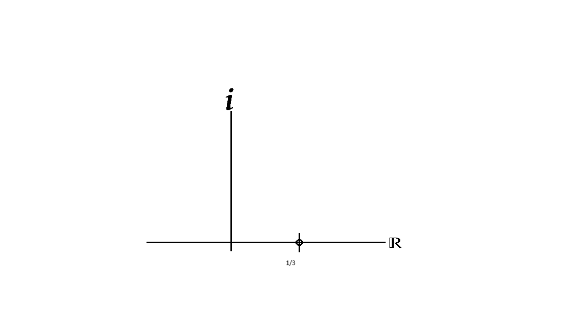

# FUNCION DE TRANSFERENCIA, ZEROS Y POLOS
En clase se abordó el tema de la función de transferencia, explicando en qué consiste y cómo se clasifica según el grado del polinomio. También se aprendió a calcular los ceros y los polos, así como a identificar el grado de una función de transferencia. Además, se estudió el teorema del valor final y se analizaron los efectos que tienen diferentes tipos de entradas al sistema, como una señal escalón o una rampa.

# 1. Funcion  de transferencia
> 🔑 Esta consiste en aplicar la transformada de Laplace a la ecuación diferencial del sistema, despejando la relación entre la salida y la entrada, de forma que se obtiene:
$$ \frac{Y(s)}{U(s)}$$

> 🔑 Esto se aplica únicamente cuando se desea obtener funciones de transferencia. En cambio, si se quiere resolver directamente la ecuación diferencial, es necesario considerar las condiciones iniciales, las cuales no siempre son iguales a cero.

## 2. Clasificación
Una función de transferencia se puede expresar como una fracción algebraica, donde N(s) representa el numerador y D(s) el denominador. En este contexto, se denomina n al grado del polinomio en el numerador y m al grado del polinomio en el denominador.

$$ G(s)=\frac{N(s)}{D(s)}$$

Según esto, se pueden diferenciar tres casos para clasificar la función de transferencia:

Si n > m, la función es impropia.
 >🔑Esto significa que la función entrega energía sin haber recibido ninguna.

Si m > n, la función es estrictamente propia.

 > 🔑Significa que el sistema requiere energía para poder entregar energía.

Si n = m, la función bipropia.

 >🔑El sistema entrega energía simultáneamente a como la recibe, es decir, en el mismo instante en que ingresa energía.

## 3. Zeros de una funcion de transferencia
Si se iguala N(s) a cero, se obtienen los valores de s que cumplen esa condición; cuando el numerador es cero, toda la función de transferencia se anula, por lo que a estos valores se les llama ceros. Estos valores pueden ser reales o complejos, lo que permite ubicarlos en un plano cartesiano.

💡 Ejemplo: 
$ G(s)=\frac{Y(s)}{U(s)}= \frac{3s-1}{s^{2}+3s+2}$
$N(s)=0$  por lo cual $3s-1=0$

$s=\frac{1}{3}$

  

  

 Un sistema lineal es aquel que cumple con el principio de superposición, lo que significa que la respuesta a múltiples entradas simultáneas es la suma de las respuestas individuales a cada entrada por separado. Además, presenta proporcionalidad, es decir, si la entrada se escala, la salida también lo hace en la misma proporción.
Por otro lado, los sistemas no lineales no cumplen con el principio de superposición. Sin embargo, pueden linealizarse en torno a un punto de operación específico, donde su comportamiento se aproxima al de un sistema lineal.
En resumen, los sistemas lineales son predecibles y más fáciles de analizar matemáticamente, mientras que los no lineales requieren métodos adicionales, como la linealización, para su estudio en ciertos rangos de operación. 
## 3.1. Modelamiento y validación
Al crear un modelo matemático usando leyes físicas, siempre habrá un margen de error en los resultados. Para asegurarse de que el modelo sea preciso, es necesario compararlo con el sistema real. Si la diferencia es demasiado grande, se deben hacer ajustes hasta que el resultado sea suficientemente cercano. 
## 3.2. Influencia de parámetros
Tomando como referencia un resorte, su comportamiento puede ser sinusoidal, presentar un decaimiento exponencial o una combinación de ambos.
* *Comportamiento sinusoidal* es cuando su respuesta varía en el tiempo siguiendo la forma de una onda seno o coseno. Esto significa que la salida oscila periódicamente, subiendo y bajando en un patrón repetitivo, en el caso del resorte seria como si este se estirara y se retraese sin desagaste, es decir, sin disminuir la distacia que se estira.
* *Decaimiento exponencial* es un comportamiento en el que una cantidad disminuye progresivamente a lo largo del tiempo siguiendo una curva exponencial decreciente, en el caso del resorte a medida del tiempo tiende a dejar de estirarse a la misma deistancia, tendiendo a irse a reposo.
* *Combinacion de ambos* es cuando la respuesta varia en el tiempo, pero su amplitud disminuye gradualmente hasta desaparecer, en el caso del resorte que tenga un amortiguamiento, por ejemplo encontrarse sumergido en agua.
## 4. Repaso
Se recuerda lo fundamental  de reconocer una ecuación diferencial, ya que permite modelar dinámicamente distintos sistemas. Además, algunos conceptos de cálculo vectorial son clave para comprender ciertos procesos relacionados.
### 4.1 Ecuaciones diferenciales
Las ecuaciones diferenciales son expresiones matemáticas que relacionan una función con sus derivadas. Se utilizan para relacionar la evolución de sistemas  en el tiempo, describiendo cómo una variable cambia en función de otra(tiempo). 

### 4.2 Transformada de LaPlace
La transformada de Laplace es una técnica matemática que permite cambiar una ecuación del tiempo al dominio de la frecuencia, haciendo más fácil su análisis. Convierte ecuaciones con derivadas en ecuaciones más simples de resolver.
## 5. Transformada Inversa de LaPlace 
La transformada inversa de Laplace permite regresar una ecuación del dominio de la frecuencia al dominio del tiempo. Su objetivo es recuperar la función original después de haber sido transformada, facilitando la interpretación del comportamiento del sistema en el tiempo.
## 💡6. Ejemplo
Se realiza el siguiente ejemplo en clase:

$$G(s)=\frac{2s^{2}-4}{(s+1)(s+2)(s-3)}$$

Se repasa el tema de fracciones parciales para resover la transformada de LaPlace inversa, siendo en este caso separar el denominador y asignar variables para resolver el sistema, tal que: 

$$G(s)=\frac{A}{(s+1)}+\frac{B}{(s-2)}+\frac{C}{(s-3)}=\frac{2s^{2}-4}{(s+1)(s+2)(s-3)}$$

Se resuelven las fracciones del lado izquierdo quedando de tal manera y luego igualando numerador con numerador: 

$$A(s-2)(s-3)+B(s+1)(s-3)+C(s+1)(s-2)=2s^{2}-4$$

Se resuleven parentesis: 

$$A(s^{2}-5s+6)+B(s^{2}-2s-3)+C(s^{2}-s-2)=2s^{2}-4$$

Se plantea el sistema de ecuaciones 3x3 igualando terminos similares en las dos partes de la igualadad, es decir:

 1. $$A+B+C=2$$
 
 2. $$-5A-2B-C=0$$
 
 3. $$6A-3B-2C=-4$$
 
Despejando el sistema 3x3 por metodo de sustitucion queda que: 

1. $$A=2-C-B$$
    
2.Reemplazamos 1 en 2
   
$-5(2-C-B)-2B-C=0$

$-10+5C+5B-2B-C=0$

$-10+4C+3B=0$

$4C+3B=10$

$C=\frac{10-3B}{4}$

3. Remplazmos 1 y 2 en 3

$6(2-C-B)-3B-2(\frac{10-3B}{4})=-4$

$12-6C-6B-3B-2(\frac{10-3B}{4})=-4$

$12-6(\frac{10-3B}{4})-6B-3B-2(\frac{10-3B}{4})=-4$

$12-(\frac{60-18B}{4})-9B-(\frac{20-6B}{4})=-4$

$12-15+(\frac{18B}{4})-9B-5+(\frac{6B}{4})=-4$
 
$-8-9B+(\frac{18}{4}+\frac{6}{4})B=-4$

$-8-9B+6B=-4$

$-9B+6B=4$

$-3B=4$

$B=\frac{-4}{3}$

4.Remplazamos valor de B y C en 1

$A=2-C-B$

$A=2-(\frac{10-3(\frac{-4}{3})}{4})-(\frac{-4}{3})$

$A=\frac{-1}{6}$

5.Remplazmos valor de B en 2

$C=\frac{10-3B}{4}$

$C=(\frac{10-3(\frac{-4}{3})}{4})$

$C=\frac{7}{2}$

Por ultimo: 

$$G(s)=\frac{\frac{-1}{6}}{s+1}+ \frac{\frac{-4}{3}}{s-2}+ \frac{\frac{7}{2}}{s-3}$$

#  7.Ejercicios
📚 1. 
$$W(s)=\frac{3s+2}{(s-5)(s+2)}$$

$W(s)=\frac{A}{(s-5)}+\frac{B}{(s+2)}=\frac{3s+2}{(s-5)(s+2)}$

$A(s+2)+B(s-5)=3s+2$

$As+2A+Bs-5B=3s+2$

$A+B=3$

$2A-5B=2$

1. $A=3-B$
2.
$2(3-B)-5B=2$

$6-2B-5B=2$

$6-7B=2$

$-7B=-4$

$B=\frac{4}{(7)}$

3.
$A=3-(\frac{4}{7)}$
   
$A=\frac{17}{(7)}$

$$W(s)=\frac{\frac{17}{7}}{(s-5)}+\frac{\frac{4}{7}}{(s+2)}$$

📚 2. 
$$F(s)=\frac{(s-5)}{(s+3)(s-2)}$$ 

$F(s)=\frac{(s-5)}{(s+3)(s-2)}=\frac{A}{(S-5)}+\frac{B}{(S-2)}$

$A(s-2)+B(s+3)=s-5$

$As-2A+Bs+3B=s-5$

$A+B=1$

$-2A+3B=-5$

$A=1-B$

$-2(1-B)+3B=-5$

$-2+2B+3B=-5$

$B=\frac{-3}{(5)}$

$A=1-(\frac{-3}{(5)})$

$A=\frac{8}{(5)}$

$$F(s)=\frac{\frac{8}{(5)}}{(S-5)}+\frac{\frac{-3}{(5)}}{(S-2)}$$

## 8. Conclusiones
En conclusión, la clase explicó qué son los sistemas dinámicos y cómo se pueden estudiar usando modelos matemáticos y ecuaciones diferenciales. Se diferenciaron los sistemas lineales y no lineales, resaltando la importancia de validar los modelos para que sean precisos. También se repasó la transformada de Laplace y su inversa, herramientas útiles para resolver ecuaciones de manera más sencilla.

## 9. Referencias
Ejercicio 1: Ejemplo formulado por el estudiante
Ejercicio 2: Platzi. (s.f.). Transformada de Laplace de la derivada de una función - PVI - Repaso. Recuperado el [fecha de consulta], de https://platzi.com/tutoriales/1320-ecuaciones/8937-transformada-de-laplace-de-la-derivada-de-una-funcion-pvi-repaso/
